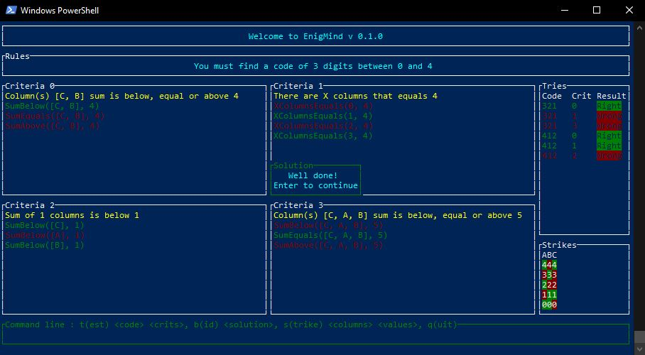
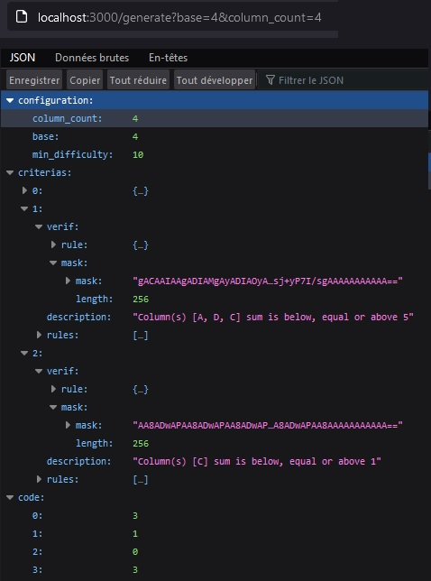

# enigmind

---

This repository contains my own development of a mastermind-like game called EnigMind. Your objective is to find a secret code based on logic rules and criterias. The projet contains :- the library handling the game behavior (using my bitmask library)
- a server that can generate a secret code and all the rules and criterias needed to logically solve it (using the library itself)
- a basic console client that requests the server to receive the game data and displays it/provides basic interface for user to play the game
- a more advanced tui client with mouse support where you can test codes against given criterias and cross out rules and values that do not match with the test results, until you finally do a bid on the secret code that you think is right

The overall objective for this repository was to explore multiple aspects of the Rust language such as 
- tui interface library
- asynchronous data handling from JSON api
- test clippy lints to better secure the codebase
- general code manipulation and training

### Improvements

Multiple improvements can be made to the project : 
- Modify tui implementation to communicate with server api to generate codes with user-defined parameters (base and column count)
- Refactor tui code to better modularize the code
- Extract widget click events emulation support and propose it to the tui community
- add tests to the library
- provide general documentation of the library and clients 
- Extend game playability by adding features (more complex puzzles, change code generation to make it seedable and share puzzles to friends for them to compete against yourself, ...)

### License

Licensed under either of

 * Apache License, Version 2.0, ([LICENSE-APACHE](LICENSE-APACHE) or http://www.apache.org/licenses/LICENSE-2.0)
 * MIT license ([LICENSE-MIT](LICENSE-MIT) or http://opensource.org/licenses/MIT)

at your option.

---

### Contribution

Unless you explicitly state otherwise, any contribution intentionally submitted
for inclusion in the work by you, as defined in the Apache-2.0 license, shall be dual licensed as above, without any
additional terms or conditions.
